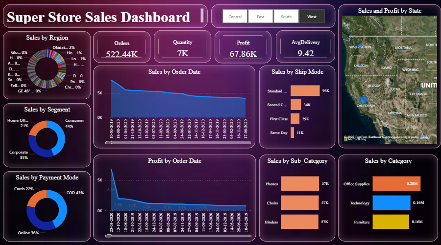

# Superstore Sales Dashboard

## Project Summary
This project is a **Superstore Sales Dashboard** created in **Power BI**. It provides interactive visualizations and insights to help businesses analyze sales performance, top products, regional trends, and customer behavior.

## Tools Used
- Power BI
- Superstore Sales (CSV)

## Features
- **Sales Trends Over Time:** Analyze monthly and yearly sales patterns 📈
- **Top Products & Categories:** Identify products and categories generating the most revenue ⭐
- **Regional Performance:** Compare sales across different regions 🌎
- **Customer Insights:** Understand top customers and their purchasing behavior 🛍️

## Instructions
1. Download the `.pbix` file from this repository.
2. Open the file in **Power BI Desktop**.
3. Explore the dashboard using interactive filters and slicers.

## Screenshots (Optional)

